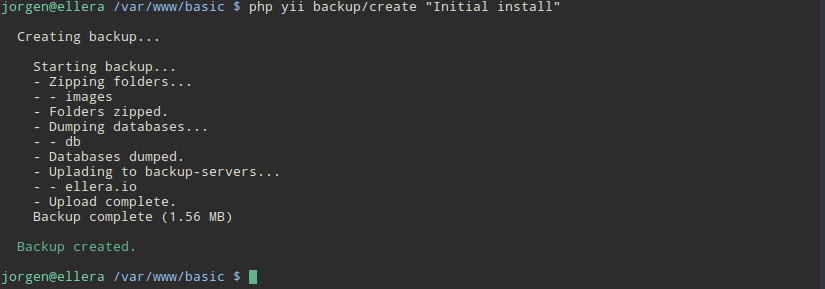
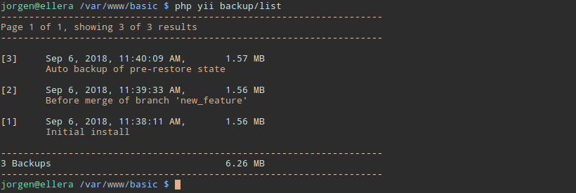

# Yii2-Backup
Console backup for yii2 applications. 

Current limitations:
- Currently only MySQL on localhost is supported
- Requires a linux system

## Getting started

Installation
------------

The preferred way to install this extension is through [composer](http://getcomposer.org/download/).

Either run

```
php composer.phar require ellera/yii2-backup
```

or add

```
"ellera/yii2-backup": "*"
```

to the require section of your `composer.json` file.

Basic Usage
-----------
Add the following to your config file. For yii2 advanced template, this should be placed in `console/config/main.php`, for basic it should be in `config/console.php`.
You can use another name then `backup` but you'll need to adjust the commands accordingly. 
```php
'modules' => [
    ...
    'backup' => [
        'class' => 'ellera\backup\Module'
    ]
    ...
]
```
Then migrate database migrations. This will create a table named `backup` in your database. 

```text
php yii migrate/up --migrationPath=@vendor/ellera/yii2-backup/src/migrations
```

When the migration is done, you're ready to backup your site. Use `php yii *command*` or `./yii *command*` with the commands from the following table:

| Command | Description | 
| --- | --- |
| backup | List all the available commands | 
| backup/create "Optional comment" | Show file differences that haven't been staged |
| backup/list #OptionalPage | Lists the current backups | 
| backup/delete #ID | Deletes a backup | 
| backup/restore #ID | Restores a backup | 

##### Manual: Create backup
`php yii backup/create "Your Comment"`



##### Manual: List backups
`php yii backup/list (# optional page number)`


##### Manual: Restore backup
`php yii backup/restore #`


This will create an additional backup of the state before the restore



##### Manual: Delete backup
`php yii backup/delete #`


Advanced  Usage
---------------
##### Backing up files and folders
You can backup as many locations as you'd like by adding them to the folders array. To create backups require read access to the folder and files, to restore requires write/delete access.
The folders will be zipped and saved in the backup folder.
```php
'modules' => [
    ...
    'backup' => [
        'class' => 'ellera\backup\Module',
        'folders' => [
            'images' => '@app/web/images'
        ],
    ]
    ...
]
```

##### Changing or adding database handlers
You can backup as many databases as you'd like, but they have to be defined in your config as `yii\db\Connection`s. Add the connection name to the array (defautls to only `db`).
```php
'modules' => [
    ...
    'backup' => [
        'class' => 'ellera\backup\Module',
        'databases' => [
            'db', 
            'db2'
        ],
    ]
    ...
]
```

##### Database Conflict
If you already have a table named `backup`, create a table with your own migration and add `'table' => 'new_table_name'` to the configuration.
The content of the table can be found in the [migration](src/migrations/m180828_154717_backup.php).
```php
'modules' => [
    ...
    'backup' => [
        'class' => 'ellera\backup\Module',
        'table' => 'your_new_table_name'
    ]
    ...
]
```
##### Change the default backup location
If you want to store the backups in another directory, add `'path' => 'new/path'` to the config.

This variable is parsed trough `Yii::getAlias()` and defaults to `@app/_backup`.

```php
'modules' => [
    ...
    'backup' => [
        'class' => 'ellera\backup\Module',
        'path' => '@app/_backup'
    ]
    ...
]
```
##### Upload to remote server
If you want redundant backup over several servers, this module supports `scp` over SSH.
For this function to work, you need to have SSH keys in place and the user must have write access to the remote folder specified in the config.
It's **highly** recommended to create a user on the remote server for this purpose - do not use root.

```php
'modules' => [
    ...
    'backup' => [
        'class' => 'ellera\backup\Module',
        'servers' => [
            // Unique name
            'server_name' => [
                // Server IP or domain
                'host' => '192.186.0.1',
                // Server username
                'user' => 'remote_user',
                // Remote backup path
                'path' => '/var/backups/myserver'
            ]
        ]
    ]
    ...
]
```